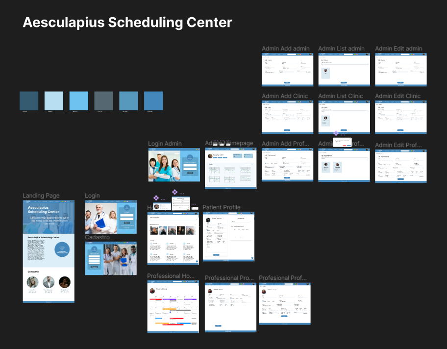

# 👩🏻‍⚕️ Aesculapius Scheduling Center 👩🏻‍⚕️

Team Orange is now developing the final version of the Entra21 project. You can check the prototype The initiative is to facilitate the scheduling of medical appointments with professionals from different areas of health. There are initially three profiles, the Patient, the Doctor - which can be any healthcare professional - and the Admin. To use the program, simply register, informing common data such as name, CPF (for the health professional, the CRM, CRE, CRO or CRP number for example), address for example. Patients will be able to search for which doctor will be available at the time they need it, they will be able to see their own appointments, change their dates and times, change professionals or even cancel an appointment. The doctor, on the other hand, will be able to share available times and days for patient care, view their appointments for the day and cancel a pre-booked appointment.

 

1st step : Prototyping 👨🏻‍🎨

One of the most important parts of developing, its prototype the system, because it makes the process of structuring the application a lot easier when comes about designing the screens. Thinking about it, Orange Team took some hours and a lot of imagination to desing the system layout. We used Figma for this. Here is the preview :

 

 

 

2nd step: Define the project management 🤖

Another important point about development, it's to define the software to manage all the tasks on the backlog. For this, we used Trello.

 

  

 

3rd step : Project Versioning 🧩

To manage the project versioning, we created an organization at Git. We organized the repositories between front-end and back-end.

 

 

 

4th step : Front end 🎨

Basing our concepts on the best practices of the front end developing, we are using Angular, a typescript framework, developed by Google. Angular is a framework based on the component concept. Each part of the code can be a component, with their own logic and peculiarities. We organized the components based on the user access. We have the components to the patient, the professional and the admin.
Each one has their own services and models, that comunicate with the back end , sending  the requests.

 

 

